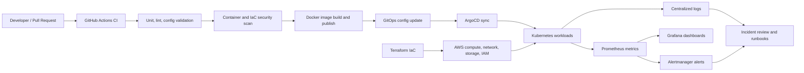

# Production Kubernetes DevOps Platform

Sanitized public reference for a production DevOps platform built and operated with Kubernetes, AWS, Terraform, GitHub Actions, ArgoCD, Docker, Prometheus, Grafana, Alertmanager, CloudWatch, and security automation.

This repository is intentionally public-safe. It does not contain employer source code, internal project names, customer data, hostnames, IP addresses, account IDs, secrets, private topology, or proprietary configuration. The examples are reconstructed from real operating patterns using placeholders.

## What This Demonstrates

- Built and operated a self-managed Kubernetes platform for production workloads on AWS infrastructure.
- Standardized infrastructure provisioning with Terraform modules for compute, networking, load balancing, object storage, and environment separation.
- Designed CI/CD paths with GitHub Actions, Docker image builds, vulnerability scanning, deployment validation, and controlled rollouts.
- Used GitOps-oriented deployment patterns with ArgoCD and Kubernetes manifests for repeatable application delivery.
- Operated monitoring and incident response workflows using Prometheus, Grafana, Alertmanager, CloudWatch, logs, dashboards, alerts, and runbooks.
- Improved cloud security posture through IAM hardening, RBAC, vulnerability remediation support, WAF tuning, and least-privilege access patterns.
- Supported production reliability, cost optimization, audit readiness, and operational maturity across cloud and Kubernetes environments.

## Architecture At A Glance

## Platform Scope

| Area | Public-safe implementation summary |
|------|------------------------------------|
| Cloud infrastructure | AWS-based compute, networking, storage, load balancing, IAM, and environment separation managed through Terraform. |
| Kubernetes platform | Self-managed Kubernetes cluster with control-plane and worker-node separation, production workload scheduling, rollout validation, and operational runbooks. |
| CI/CD | GitHub Actions pipelines for validation, Docker builds, security scans, registry publishing, deployment automation, and rollback-aware releases. |
| GitOps | ArgoCD-style desired-state deployment model for application manifests and environment-specific configuration. |
| Observability | Prometheus, Grafana, Alertmanager, CloudWatch, log review, dashboards, alert routing, and incident visibility improvements. |
| Security operations | IAM least privilege, RBAC, vulnerability remediation support, Trivy scanning, WAF tuning, secrets hygiene, and audit support. |
| Automation workloads | Scheduled and event-driven automation workloads deployed as Kubernetes Jobs and CronJobs. |

## Operating Outcomes

These outcomes are summarized at a public-safe level from professional production operations:

- Supported 60+ production workloads across cloud, platform, and application operations.
- Operated 40+ Kubernetes-hosted production workloads with high availability expectations.
- Maintained 99%+ service availability across supported environments.
- Reduced infrastructure cost by approximately $94K per year through self-managed platform design and cloud optimization.
- Reduced release cycle time from days to hours through CI/CD and deployment automation.
- Reduced malicious traffic exposure by 90%+ through AWS WAF and security control improvements.
- Improved incident visibility and response time through monitoring, alerting, and operational runbooks.
- Improved compliance and audit response time by approximately 50% through standardized evidence and infrastructure documentation.

## Repository Map

| Path | Purpose |
|------|---------|
| `docs/architecture.md` | Public-safe architecture narrative and platform layers. |
| `docs/cicd.md` | CI/CD design, gates, deployment flow, rollback model, and validation strategy. |
| `docs/observability.md` | Monitoring, alerting, dashboard, log, and incident response model. |
| `docs/security-and-governance.md` | IAM, RBAC, vulnerability, WAF, and audit-readiness controls. |
| `docs/operations-and-dr.md` | Day-2 operations, runbooks, backup, recovery, and on-call practices. |
| `docs/public-sanitization.md` | What was intentionally removed or generalized for public release. |
| `examples/` | Sanitized example YAML, Terraform, ArgoCD, monitoring, and GitHub Actions snippets. |
