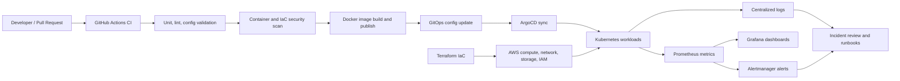
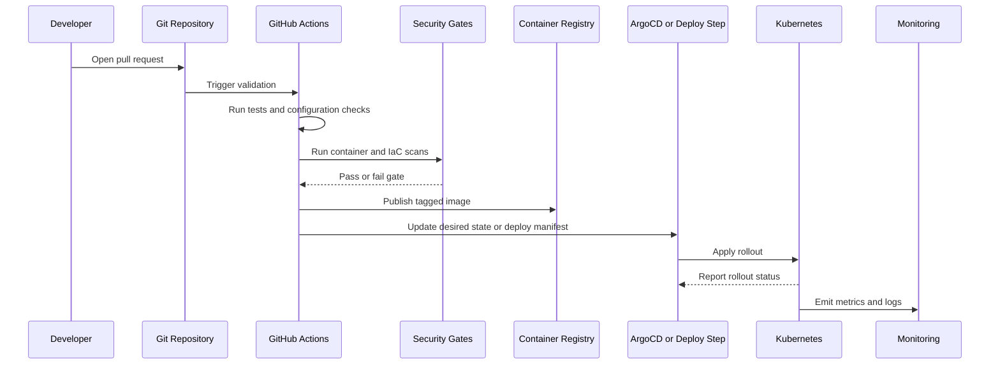
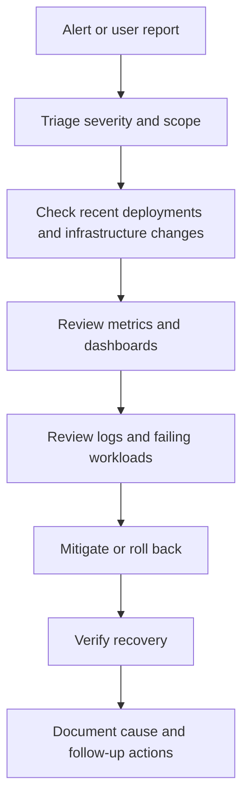

# Production Kubernetes DevOps Platform

Production DevOps platform case study for Kubernetes, AWS, Terraform, GitHub Actions, ArgoCD, Docker, Prometheus, Grafana, Alertmanager, CloudWatch, and security automation.

This repository shows how a production platform was designed, delivered, secured, monitored, and operated across cloud infrastructure, Kubernetes workloads, CI/CD, observability, and day-2 operations. It is organized around the DevOps and DevSecOps capabilities that repeatedly appeared in a Fortune 500 JD analysis: cloud, Kubernetes, CI/CD, observability, IAM, vulnerability management, compliance evidence, policy-as-code, supply chain security, and AI-era delivery guardrails.

## Executive Snapshot

| Area | Production summary |
|------|--------------------|
| Platform type | Self-managed Kubernetes platform on AWS infrastructure. |
| Workload scope | 60+ production workloads supported across cloud, platform, application, and automation operations. |
| Kubernetes scope | 40+ Kubernetes-hosted production workloads operated with rollout validation, monitoring, and runbooks. |
| Reliability | Maintained 99%+ availability across supported environments. |
| Cost optimization | Reduced AWS infrastructure cost by approximately $94K per year through platform design and cloud optimization. |
| Delivery improvement | Reduced release cycle time from days to hours through CI/CD and deployment automation. |
| Security improvement | Reduced malicious traffic exposure by 90%+ through AWS WAF and security control improvements. |
| Operational maturity | Improved incident visibility, response time, and audit response speed through monitoring, alerting, evidence, and documentation. |

## Market-Aligned Evidence Map

The repo is structured around a public-source Fortune 500 DevOps/DevSecOps market snapshot of 380 official-verified active postings. The strongest signals were traditional DevOps foundations with a growing security and governance layer.

| Market signal | JD signal | Repo evidence |
|---------------|-----------|---------------|
| Cloud platforms | 322/380 postings, 85% | AWS foundation, Terraform structure, cost optimization, IAM examples. |
| IAM and least privilege | 237/380 postings, 62% | IAM hardening pattern, scoped role examples, audit-ready access boundaries. |
| Observability | 223/380 postings, 59% | Prometheus, Grafana, Alertmanager, CloudWatch, incident review model. |
| Incident and on-call ownership | 229/380 postings, 60% | Day-2 operations, rollback flow, runbook and triage patterns. |
| CI/CD | 181/380 postings, 48% | GitHub Actions pipeline, validation gates, scan gates, deployment handoff. |
| Kubernetes | 165/380 postings, 43% | Workload model, rollout safety, RBAC, network policy, admission policy examples. |
| Terraform and IaC | 140/380 postings, 37% | Public-safe Terraform foundation and least-privilege guardrail direction. |
| Vulnerability management | 119/380 postings, 31% | Trivy gate, risk triage example, remediation evidence pattern. |
| Compliance and risk | 195/380 compliance mentions, 194/380 risk mentions | Change review, audit evidence, risk acceptance, control mapping roadmap. |
| AI-era platform/security | 141/380 postings, 37% | AI SDLC control-plane examples for guardrails, audit logging, and human approval. |

## What This Demonstrates

- Built and operated a production Kubernetes platform rather than only using managed application hosting.
- Standardized cloud infrastructure provisioning with Terraform modules for compute, networking, load balancing, storage, IAM, and environment separation.
- Designed CI/CD paths with GitHub Actions, Docker image builds, validation gates, vulnerability scanning, deployment checks, and controlled rollouts.
- Used GitOps-oriented delivery with ArgoCD-style desired-state configuration for repeatable Kubernetes deployments.
- Operated production monitoring and incident response with Prometheus, Grafana, Alertmanager, CloudWatch, logs, dashboards, alerts, and runbooks.
- Improved security posture through IAM hardening, Kubernetes RBAC, vulnerability remediation support, WAF tuning, secrets hygiene, and audit-ready evidence.
- Demonstrated a roadmap toward policy-as-code, supply chain trust, and AI-assisted delivery governance without exposing private implementation details.
- Supported platform reliability, cost optimization, compliance response, and day-2 operational maturity across cloud and Kubernetes environments.

## Architecture At A Glance

## Platform Layers

| Layer | Responsibility | Representative work |
|-------|----------------|---------------------|
| Cloud foundation | AWS compute, networking, storage, load balancing, IAM, and environment boundaries. | Provisioned and maintained cloud resources with Terraform and standardized environment separation. |
| Kubernetes foundation | Cluster lifecycle, control-plane operations, worker capacity, namespaces, RBAC, workload scheduling, and rollout safety. | Operated self-managed Kubernetes workloads with health checks, capacity review, and recovery practices. |
| Delivery layer | GitHub Actions, Docker builds, image publishing, manifest validation, deployment automation, and GitOps sync. | Built repeatable CI/CD workflows with validation gates and rollback-aware releases. |
| Runtime layer | Deployments, Services, Jobs, CronJobs, application configuration, and health checks. | Supported web services, automation jobs, platform components, and internal services. |
| Observability layer | Metrics, dashboards, alerts, logs, incident review, and runbooks. | Connected Prometheus, Grafana, Alertmanager, CloudWatch, and logs to production support workflows. |
| Security layer | IAM least privilege, RBAC, vulnerability scanning, WAF controls, secrets hygiene, and audit evidence. | Improved access boundaries, vulnerability visibility, malicious traffic reduction, and audit response speed. |
| Governance layer | Policy-as-code, supply chain evidence, risk acceptance, and AI SDLC guardrails. | Public examples show the direction for controls that keep faster delivery auditable. |

## Kubernetes Operating Model

The platform used Kubernetes as the runtime foundation for production applications, automation workloads, and shared platform services.

| Capability | Operating model |
|------------|-----------------------------|
| Workload isolation | Namespaces and RBAC were used to separate ownership and operational boundaries. |
| Rollout safety | Readiness checks, liveness checks, rollout status checks, and rollback paths were used to reduce failed deployment impact. |
| Runtime patterns | Deployments, Services, Jobs, and CronJobs supported both long-running services and scheduled automation. |
| Capacity management | Node, pod, CPU, memory, disk, and pressure signals were reviewed to prevent avoidable incidents. |
| Operational support | Common failure modes were documented through runbooks and monitored through dashboards and alerts. |
| Production hygiene | Secrets, environment-specific configuration, and deployment manifests were managed with controlled source and deployment practices. |

## CI/CD And Release Flow

The CI/CD model was designed to reduce manual deployment work, improve release consistency, and add security checks before production rollout.

### Standard Pipeline Gates

| Gate | Purpose |
|------|---------|
| Source review | Keep changes intentional, scoped, and reviewable. |
| Build validation | Confirm the application or automation artifact can build reproducibly. |
| Unit or smoke tests | Catch basic defects before rollout. |
| Manifest validation | Catch Kubernetes YAML and configuration errors early. |
| Container scanning | Identify high-risk image vulnerabilities before deployment. |
| SBOM generation | Preserve dependency visibility for audit and remediation workflows. |
| Artifact signing and provenance | Connect a released artifact to source, workflow, and approval evidence. |
| IaC validation | Reduce Terraform syntax and plan errors before infrastructure changes. |
| Image tagging | Connect deployed images back to source commits and deployment events. |
| Rollout status | Detect failed or stuck Kubernetes deployments quickly. |
| Post-deploy checks | Confirm service health after deployment. |

### Deployment And Rollback Model

- GitOps-based delivery used desired-state commits and ArgoCD reconciliation.
- Direct Kubernetes deployment paths used rollout status and validated previous image tags.
- Infrastructure changes were kept reviewable through Terraform planning and scoped applies.
- Failed releases were handled through rollback, revert, or redeploy paths depending on the deployment method.

## Infrastructure As Code

Terraform was used to make cloud infrastructure repeatable, reviewable, and easier to audit.

| IaC area | Implementation summary |
|----------|------------------------------------|
| Compute | Provisioned and maintained compute capacity for Kubernetes and supporting workloads. |
| Networking | Managed network boundaries, security groups, load balancing, and environment segmentation. |
| Storage | Managed object storage and selected backup-related resources. |
| IAM | Defined roles, policies, and permission boundaries with a least-privilege direction. |
| Environment separation | Kept production and non-production configuration separated and reviewable. |
| Change review | Used Terraform validation, plan review, and scoped change sets to reduce infrastructure risk. |

## Observability And Incident Response

The observability model connected cloud infrastructure, Kubernetes workloads, application behavior, deployment state, and incident response.

| Signal | Example use |
|--------|-------------|
| Availability | Service up/down status, endpoint checks, and rollout health. |
| Latency | Request duration, slow dependency behavior, and user-facing performance. |
| Errors | Application error rate, failed jobs, crash loops, and failed deployments. |
| Saturation | CPU, memory, disk, pod capacity, node pressure, and queue depth. |
| Deployment health | Rollout status, restart count, image version, and failed readiness checks. |
| Security events | WAF activity, vulnerability remediation evidence, and suspicious traffic trends. |

| Component | Responsibility |
|-----------|----------------|
| Prometheus | Metrics collection and alert rule evaluation. |
| Grafana | Dashboards for workload, cluster, and service health. |
| Alertmanager | Alert grouping, routing, and escalation support. |
| CloudWatch | Cloud infrastructure telemetry and operational visibility. |
| Centralized logs | Application and platform log review during incident investigation. |

Production improvements included better incident visibility, faster response, clearer operational ownership, and stronger post-incident evidence through dashboards, alerts, deployment context, and runbooks.

## Security And Governance

The security model focused on practical controls that improved production safety without blocking engineering velocity.

| Control area | Implementation summary |
|--------------|------------------------------------|
| IAM | Reduced broad cloud permissions and moved toward scoped, least-privilege policies. |
| Kubernetes RBAC | Used role-based access patterns to limit who and what could change cluster resources. |
| Vulnerability management | Supported remediation through image scanning, dependency visibility, and prioritized fixes. |
| CI/CD guardrails | Added build, validation, scan, and rollout checks before production deployment. |
| WAF and edge security | Tuned AWS WAF controls to reduce malicious traffic exposure. |
| Secrets hygiene | Kept secrets out of manifests, public artifacts, and source-controlled examples. |
| Audit support | Improved evidence retrieval for infrastructure, deployment, access, and operational controls. |
| Change control | Connected source review, deployment evidence, rollback paths, and risk acceptance decisions. |
| Policy-as-code | Used admission and CI/CD policy examples to show how platform rules can be enforced consistently. |
| Supply chain trust | Added SBOM, scan, signing, and provenance examples as a roadmap extension to the production delivery model. |
| AI SDLC guardrails | Added public examples for human approval, audit logging, and tool boundary controls around AI-assisted delivery. |

### IAM Hardening Pattern

1. Identify broad managed policies and broad inline permissions.
2. Map required actions to real platform responsibilities.
3. Separate infrastructure roles by workload category where possible.
4. Scope permissions by tags, resource prefixes, and read-only discovery needs.
5. Validate that unrelated resource actions are denied.
6. Keep operational permissions for monitoring and managed instance access where needed.

### Kubernetes Security Pattern

- Use namespaces to separate workload ownership.
- Apply RBAC for operational boundaries.
- Use readiness and liveness checks for safer rollouts.
- Use network policy where service-to-service boundaries are required.
- Use image scanning before deployment.
- Keep secrets out of manifests and repositories.

## Day-2 Operations And Recovery

Production DevOps work continued after deployment through reliability, incident response, recovery, and continuous improvement practices.

| Practice | Purpose |
|----------|---------|
| Cluster health checks | Confirm node, pod, control-plane, and workload health. |
| Rollout monitoring | Detect failed deployments, crash loops, and readiness failures. |
| Capacity review | Watch CPU, memory, disk, and node pressure before it becomes an outage. |
| Alert triage | Separate actionable alerts from noise and route them to the right owner. |
| Incident support | Use dashboards, logs, recent deployments, and cloud telemetry to isolate causes. |
| Runbook maintenance | Keep common recovery steps repeatable and easy to follow under pressure. |
| Cost review | Reduce waste by reviewing usage, instance sizing, and managed service alternatives. |

Recovery practices included backup planning, selected restore validation, rollback documentation, and operational evidence needed for incident review and audit support.

## Representative Examples

The example files are generic patterns. They exist to show engineering judgment, not employer-specific implementation.

| Path | What it shows |
|------|---------------|
| `examples/github-actions/ci-cd.yml` | CI/CD stages for validation, scanning, image build, and deployment handoff. |
| `examples/argocd/application.yaml` | GitOps application structure for Kubernetes desired state. |
| `examples/kubernetes/deployment.yaml` | Deployment health checks, resource controls, and rollout-friendly configuration. |
| `examples/kubernetes/cronjob.yaml` | Scheduled automation workload pattern. |
| `examples/kubernetes/network-policy.yaml` | Example service boundary pattern. |
| `examples/monitoring/prometheus-rule.yaml` | Alert rule pattern for actionable service health monitoring. |
| `examples/terraform/` | Terraform structure for cloud foundation concepts. |
| `examples/policy-as-code/` | Kyverno admission policies with executable `kyverno test` coverage (see `examples/policy-as-code/README.md`). |
| `examples/supply-chain/` | SBOM, vulnerability scan, artifact signing, and provenance workflow pattern. |
| `examples/vulnerability-triage/` | Sanitized scan triage inputs and risk summary output. |
| `examples/ai-sdlc-control-plane/` | AI-assisted delivery guardrails, audit logging, and human approval boundaries. |

## Optional Deep Dives

The README contains the main story. The `docs/` folder keeps the same material separated into focused notes for readers who want more detail.

| Path | Purpose |
|------|---------|
| `docs/architecture.md` | Architecture narrative and platform layers. |
| `docs/market-alignment.md` | How this repo maps to the Fortune 500 JD skill signals. |
| `docs/cicd.md` | CI/CD design, gates, deployment flow, rollback model, and validation strategy. |
| `docs/observability.md` | Monitoring, alerting, dashboard, log, and incident response model. |
| `docs/security-and-governance.md` | IAM, RBAC, vulnerability, WAF, and audit-readiness controls. |
| `docs/operations-and-dr.md` | Day-2 operations, runbooks, backup, recovery, and on-call practices. |
| `docs/portfolio-roadmap.md` | Completed proof points and intentionally tracked roadmap gaps. |
| `docs/public-sanitization.md` | Disclosure boundary and removed sensitive detail categories. |

## Disclosure Boundary

This repository focuses on architecture, operating model, and engineering decisions. Employer source code, customer data, hostnames, IP addresses, account IDs, credentials, Terraform state, kubeconfigs, private topology, and proprietary configuration are not included.

## License

Released under the [Apache License 2.0](LICENSE).
