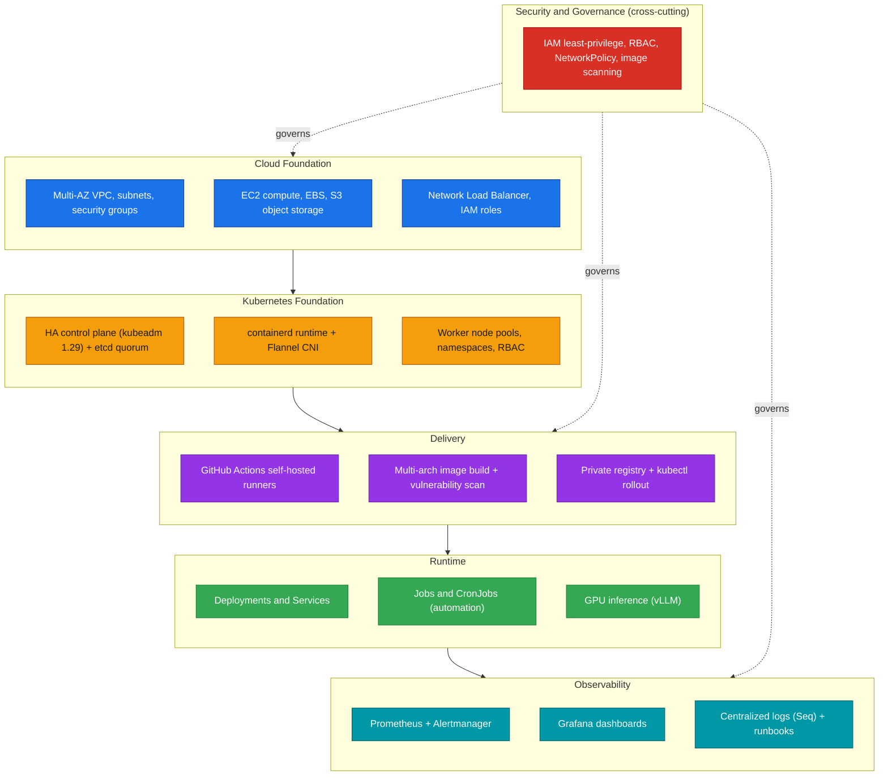
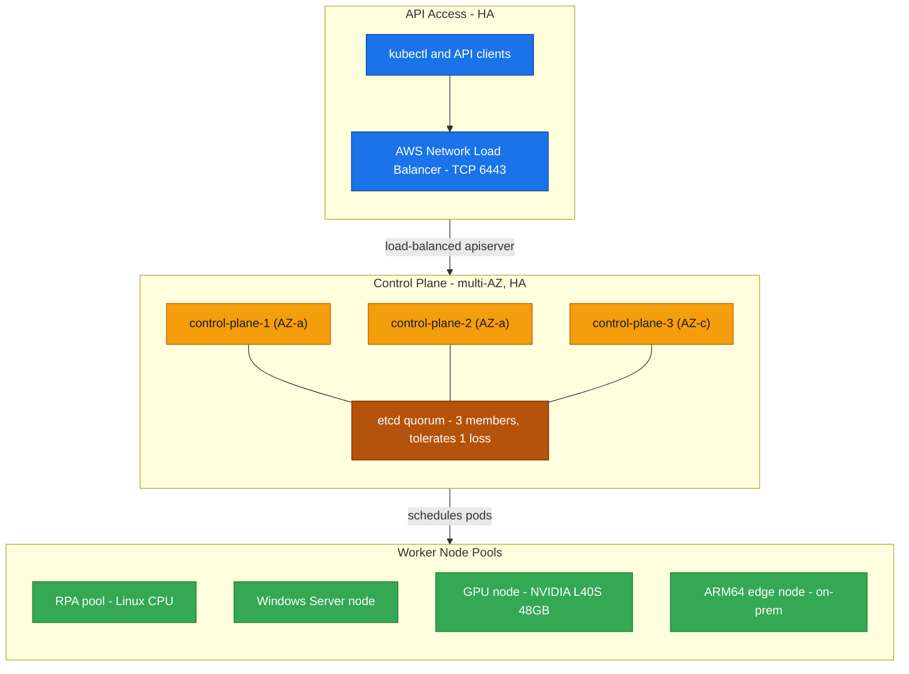
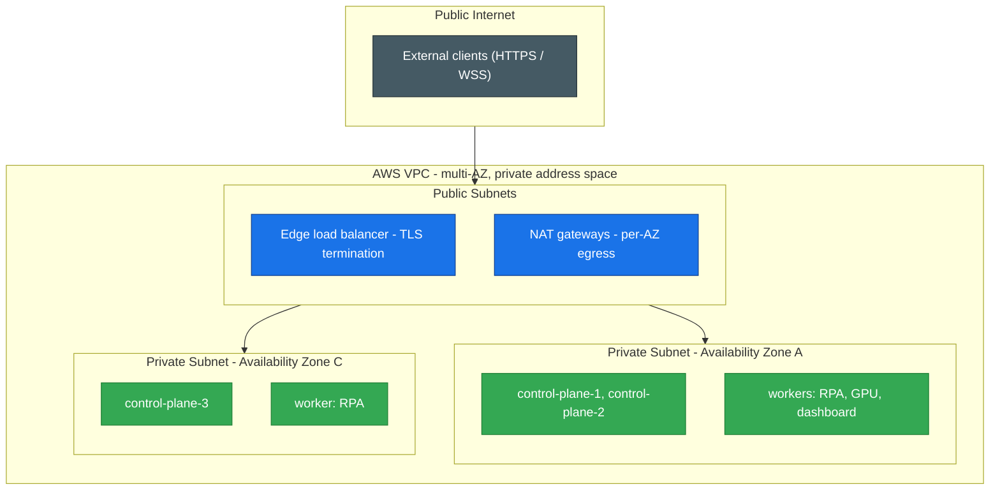

# Architecture

This platform is a self-managed cloud and Kubernetes operating model for production
applications, scheduled automation, GPU inference, and shared platform services. It was built
to be repeatable, observable, and recoverable, and to remove dependence on manual server
operations.

## Design Goals

- Provide a repeatable, reviewable deployment platform for production services and automation.
- Run a real, self-managed control plane with high availability rather than relying on a
  managed cluster service.
- Standardize cloud infrastructure with Terraform so changes are planned, reviewed, and audited.
- Make production health visible and make incidents recoverable.
- Keep least-privilege access and tenant isolation as first-class concerns.
- Reduce cost while keeping full operational control.

## Platform Layers

Six layers, from cloud foundation up to observability, with security cutting across all of them.

| Layer | Responsibility |
|-------|----------------|
| Cloud foundation | Compute, network, object storage, load balancing, IAM, and environment boundaries. |
| Kubernetes foundation | Control-plane HA, etcd, runtime, CNI, worker capacity, namespaces, RBAC, scheduling. |
| Delivery | Self-hosted CI/CD, image build and scan, registry, controlled rollout. |
| Runtime | Deployments, Services, Jobs, CronJobs, and GPU inference workloads. |
| Observability | Metrics, dashboards, alerts, logs, incident review, runbooks. |
| Security | IAM least-privilege, RBAC, network policy, secrets hygiene, scanning, audit evidence. |

## High-Availability Cluster Topology

The control plane runs three nodes across two Availability Zones with a 3-member etcd quorum,
fronted by an AWS Network Load Balancer for a single, highly available API endpoint. The quorum
tolerates the loss of one control-plane node; failover has been tested.

## Multi-AZ Network Model

Public subnets carry only edge entry points and per-AZ NAT egress. Control-plane and worker
nodes live in private subnets spread across two Availability Zones. No node is directly
reachable from the public internet.

## Workload Types

| Workload type | Description |
|---------------|-------------|
| Web and platform services | Containerized services deployed through controlled rollouts with health checks. |
| Automation jobs | Scheduled browser and data automation running as CronJobs, one task per node. |
| GPU inference | LLM serving on a dedicated GPU node with an OpenAI-compatible API. |
| Shared platform services | Observability, registry, and operational tooling supporting the rest of the platform. |
