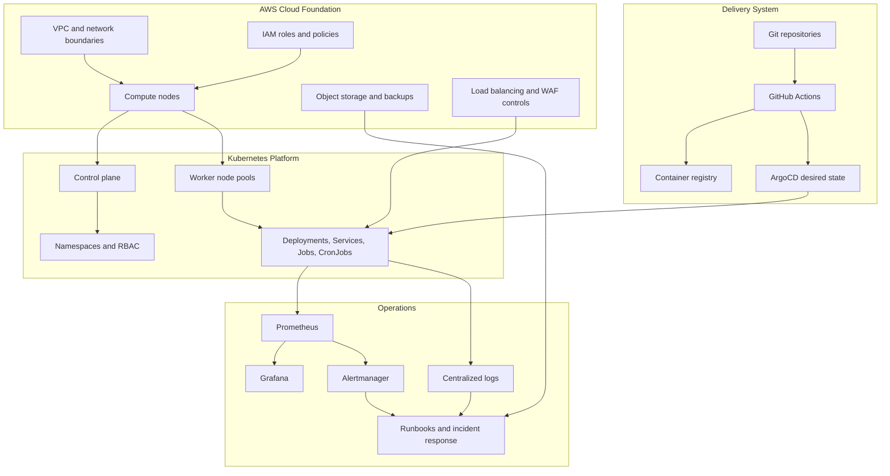

# Architecture

This platform represents a production-oriented cloud and Kubernetes operating model for application workloads, automation workloads, and internal platform services.

## Design Goals

- Provide a repeatable deployment platform for production services.
- Reduce dependency on manual server operations.
- Improve reliability through Kubernetes scheduling, rollout controls, and observability.
- Standardize cloud infrastructure with Terraform.
- Support security reviews, vulnerability remediation, and audit response with consistent evidence.
- Reduce infrastructure cost while maintaining operational control.

## Platform Layers

| Layer | Responsibility |
|-------|----------------|
| Cloud foundation | Compute, network, object storage, load balancing, IAM, security groups, and environment boundaries. |
| Kubernetes foundation | Cluster lifecycle, control-plane operations, worker capacity, namespaces, RBAC, workload scheduling, and rollout safety. |
| Delivery layer | GitHub Actions, Docker builds, image publishing, manifest validation, deployment automation, and GitOps sync. |
| Runtime layer | Deployments, Services, CronJobs, automation workloads, application configuration, and health checks. |
| Observability layer | Metrics, dashboards, alerts, logs, incident review, and runbooks. |
| Security layer | IAM least privilege, RBAC, vulnerability scanning, WAF controls, secrets hygiene, and audit evidence. |

## Cloud And Kubernetes Model

The public version intentionally avoids private topology. At a safe level, the production model used:

- AWS infrastructure as the cloud foundation.
- Terraform modules to provision and update cloud resources.
- A self-managed Kubernetes platform running on cloud compute nodes.
- Separate control-plane and worker-node responsibilities.
- Environment-specific configuration for production and non-production workloads.
- Load-balanced entry points for selected services.
- Scheduled automation workloads running as Kubernetes CronJobs.
- Monitoring and alerting integrated with operational workflows.

## Workload Types

| Workload type | Description |
|---------------|-------------------------|
| Web services | Containerized business applications deployed through controlled rollouts. |
| Automation jobs | Scheduled jobs for operational automation and business process automation. |
| Platform services | Shared platform components for observability, deployment support, and operational control. |
| AI-adjacent services | Internal services requiring reliable deployment, monitoring, and access controls. |

## Architecture Diagram

