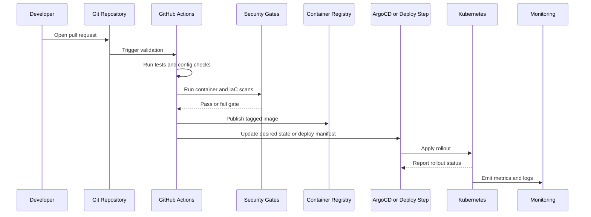

# CI/CD Design

The CI/CD model was designed to reduce manual deployment work, improve release consistency, and add security checks before production rollout.

## Pipeline Objectives

- Validate code and configuration changes before deployment.
- Build immutable container images.
- Scan images and configuration for known security issues.
- Publish versioned artifacts with traceable tags.
- Deploy through a controlled Kubernetes rollout.
- Surface deployment health quickly through rollout checks and monitoring.
- Preserve rollback paths when a deployment fails.

## Pipeline Flow



## Standard Gates

| Gate | Purpose |
|------|---------|
| Source review | Ensure the change is intentional, scoped, and reviewable. |
| Build validation | Confirm the application can build reproducibly. |
| Unit or smoke tests | Catch basic defects before rollout. |
| Manifest validation | Catch Kubernetes YAML and configuration errors early. |
| Container scan | Identify high-risk image vulnerabilities before deployment. |
| IaC validation | Reduce Terraform syntax and plan errors before infrastructure changes. |
| Rollout status | Detect failed or stuck Kubernetes deployments quickly. |
| Post-deploy checks | Confirm service health after deployment. |

## Image Tagging

The public example uses a traceable tag pattern:

```text
<service-name>:<yyyyMMdd>-<short-sha>
```

This makes it easier to connect a running workload back to a source commit and deployment event.

## Rollback Model

Rollback depends on the deployment path:

- For GitOps-based delivery, revert or roll back the desired-state commit and let ArgoCD reconcile.
- For direct Kubernetes deployment, use rollout history and validated previous image tags.
- For infrastructure changes, review Terraform plans carefully and avoid mixing unrelated changes in the same apply.

## Example

See `examples/github-actions/ci-cd.yml` for a public-safe example workflow.

