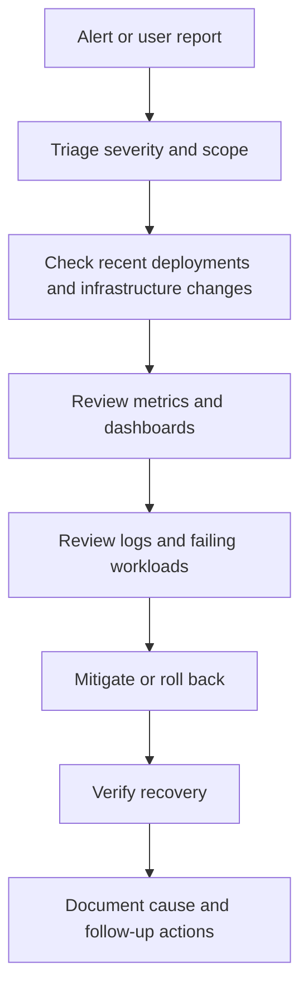

# Operations And Disaster Recovery

Production DevOps work does not end at deployment. This platform was operated with day-2 practices for reliability, incident response, recovery, and continuous improvement.

## Day-2 Operations

| Practice | Purpose |
|----------|---------|
| Cluster health checks | Confirm node, pod, control-plane, and workload health. |
| Rollout monitoring | Detect failed deployments, crash loops, and readiness failures. |
| Capacity review | Watch CPU, memory, disk, and node pressure before it becomes an outage. |
| Alert triage | Separate actionable alerts from noise and route them to the right owner. |
| Incident support | Use dashboards, logs, recent deployments, and cloud telemetry to isolate causes. |
| Runbook maintenance | Keep common recovery steps repeatable and easy to follow under pressure. |
| Cost review | Reduce waste by reviewing usage, instance sizing, and managed service alternatives. |

## Backup And Recovery

The recovery model included:

- Object storage for backup artifacts.
- Kubernetes backup and restore planning for selected workloads and configuration.
- Documented recovery objectives for key platform components.
- Restore validation as a required part of making backups trustworthy.

## Incident Response Flow

## Reliability Practices

- Use readiness checks before sending traffic to new pods.
- Use rollout status checks to fail fast when deployment is unhealthy.
- Keep rollback paths simple and documented.
- Track recurring incidents and fix the repeated cause, not only the symptom.
- Keep monitoring and deployment data close together during incident review.

## Public-Safe Outcomes

- Improved incident visibility and response time.
- Reduced manual recovery effort through runbooks and deployment automation.
- Maintained high availability expectations across production workloads.
- Improved operational maturity through documentation, monitoring, and standard workflows.

